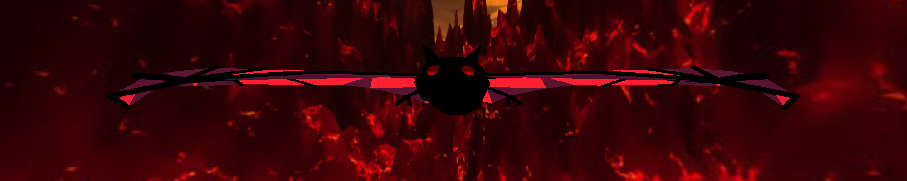

# 3D Graphics Project

This is a 3D OpenGL (C++) scene featuring a volcano in the centre of a lake of lava with bats flying overhead, originally written for a 3D graphics module as part of my undergraduate degree.

Requires linking with external GL, GLU, and GLUT libraries:

```
> g++ src/*.cpp -l GL -l GLU -l glut
```

## Controls

* W, A, S, D, Q, and E to move forward, left, backward, right, up, and down, respectively.
* Click and drag to change camera angle.
* C to toggle between perspective and orthographic projections.
* P to toggle the simulation pause state.
* V to toggle the volcano eruption state.

## Screenshots




